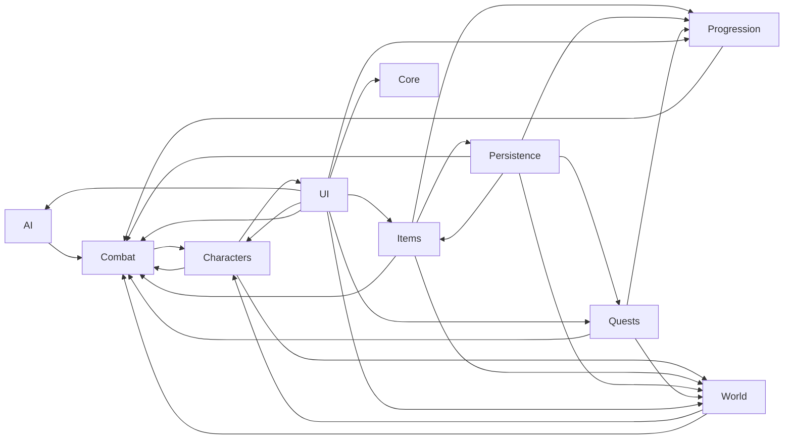
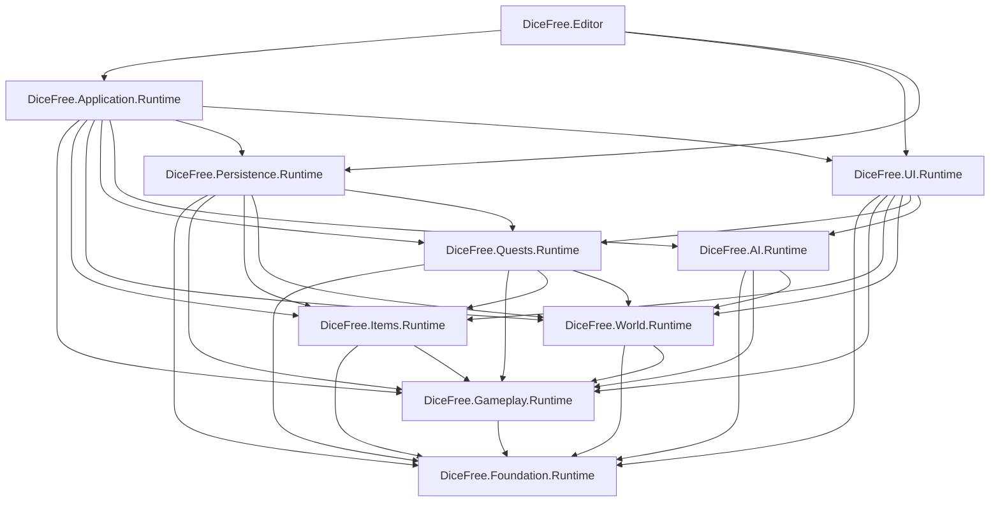
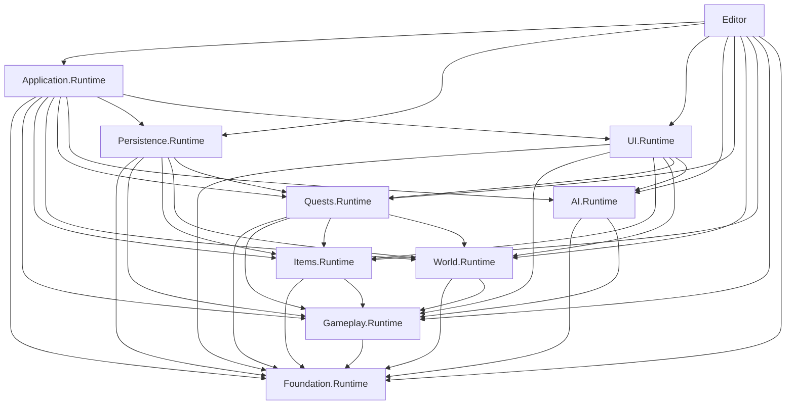

# DiceFree architecture hardening audit

**Branch:** `refactor/architecture-hardening`  
**Audit base:** `poc/cornberg` `1b574291fafc6b90d2fac1365eb4931f4bd59fa0`  
**Design contract:** `setup/unity-project` `db9bbec76ae7b42f7bbed06b952feeab481aef9b`  
**Status:** audit is complete; explicit assembly ownership and the durable
mutation boundary are implemented. Registry/event lifetime hardening is partial;
full Unity validation remains blocked by Editor licensing initialization.

The baseline inventory below was made against the actual PoC source and serialized project at the
base SHA above. The canonical architecture/design documents and ADRs in this
branch are synchronized from the verified setup branch. No gameplay implementation
or scene content was copied from setup.

## Inventory and current ownership

The project contains 126 first-party C# files under `Assets/_DiceFree/Scripts`:
88 runtime scripts and 38 scripts in `Tools/Editor`. There are no first-party
`.asmdef` or `.asmref` files. Consequently, all 126 currently compile into
Unity's predefined `Assembly-CSharp` / `Assembly-CSharp-Editor` assemblies. The
logical namespace and folder ownership is:

| Current folder / namespace | Files | Responsibility |
| --- | ---: | --- |
| `Core` / `DiceFree.Core` | 1 | exploration camera |
| `Combat` / `DiceFree.Combat` | 25 | actor definitions/stats, health, attacks, damage math, targeting, defeat facts and kill credit |
| `Characters` / `DiceFree.Characters` | 3 | traversal motor and player input adapters |
| `Progression` / `DiceFree.Progression` | 2 | XP curve and manifestation XP state |
| `Items` / `DiceFree.Items` | 8 | item definitions/instances, carried inventory, equipment, wallet, rewards and world drops |
| `World` / `DiceFree.World` | 18 | navigation, interaction, areas/conversation facts, respawn, travel surfaces and healing area |
| `Quests` / `DiceFree.Quests` | 7 | objective definitions/progress, quest giver/journal and credit policy |
| `AI` / `DiceFree.AI` | 5 | enemy variants, awareness, aggro and enemy decision behavior |
| `Persistence` / `DiceFree.Persistence` | 6 | save records, migration, local store, profile diagnostics and manifestation persistence coordinator |
| `UI` / `DiceFree.UI` | 13 | HUD, interaction, conversation, quest, inventory and combat presentation |
| `Tools/Editor` / `DiceFree.EditorTools` | 38 | Cornberg authoring/setup, automated validation, build tooling and Profile Inspector |

These are current logical owners, not the eventual assembly graph. Combat,
Characters and Progression form one Gameplay assembly in the target. Input adapters
that currently sit beside the traversal motor are composition code and need to be
separated from Gameplay without changing their serialized script GUIDs.

## Current dependency edges and cycles

All runtime code currently shares one assembly, so Unity cannot enforce source
dependency direction. Source-level namespace references show these edges:

`using` statements do not capture every fully-qualified reference, so this graph
was checked against direct type usages as well. Notable current cycles and
boundary leaks are:

* `CombatActor` uses `TraversalMotor` while the traversal/input folder reaches
  back into Combat. These can stay in one Gameplay assembly; the input adapter's
  World/UI references must leave that assembly.
* `World.SurfaceTravel` subscribes to the Gameplay `TraversalMotor` speed-source
  refresh callback. This is a valid World-to-Gameplay edge; the motor itself does
  not depend on World.
* `Items.FixedRewardGrant -> Persistence.ManifestationPersistence` and
  `Persistence.ManifestationPersistence -> Items` form a concrete infrastructure
  back-reference cycle. This is the highest-priority dependency to remove.
* `World` consumes Combat actors/health and `Characters.TraversalMotor`; these
  are valid one-way World-to-Gameplay dependencies. The input adapters in
  `Characters` are the reverse edge to remove because they reference UI and World.
* `Quests` uses Combat, Progression and World; it must call an item/reward
  contract without making Items depend on Quests or Persistence.
* `UI` is already a presentation leaf conceptually, but its references are not
  mechanically constrained.
* Editor tooling references nearly every runtime domain by design; runtime code
  must not reference `DiceFree.EditorTools` or `UnityEditor`.

## Concrete persistence and transaction boundary

`QuestJournal` delegates completion rewards to `Items.FixedRewardGrant`.
`FixedRewardGrant` currently looks up concrete
`Persistence.ManifestationPersistence` on the recipient and opens its
`DeferWrites()` scope. `ManifestationPersistence` captures the transaction after
it exits. This arrangement is what currently prevents autosave from capturing a
partial XP/gold/item reward; it also rolls runtime state back if a reward step
fails. The assembly split must preserve those semantics.

The planned cut is a small low-level durable-mutation/write-deferral contract.
Persistence implements it; reward application consumes the contract. Neither
Items nor Quests will know the concrete persistence component, and no static
service locator will be added. Tests must keep proving guarded quest completion,
single logical durable mutation, no intermediate save, rollback after downstream
failure, reentrancy safety and no replay. Save v4 and its record formats remain
unchanged.

`ManifestationPersistence` is currently both the local-save coordinator and the
composition point that reads/writes concrete XP, quest, actor/respawn, inventory,
equipment and wallet components. It may remain a leaf infrastructure coordinator
in this slice; splitting it further is only justified if a real contract boundary
requires it. Its use of `UnityEditor.SessionState` is behind `#if UNITY_EDITOR`
but still puts an editor API reference in runtime source. Move that test-only
switch to Editor-side composition so the runtime assembly has no editor reference.

## Mutable static state and lifetime

Runtime mutable global/session state found:

| State | Current use | Hardening decision |
| --- | --- | --- |
| `CombatActor.All` | awareness, targeting, area checks and validation | remains a static compatibility registry; duplicate-safe registration and subsystem reset prevent cross-session leakage; conversion to explicit session ownership remains debt |
| `DefeatEvents.Reported` | kill credit, quest credit, fixed world drops | remains a typed static fact stream; subscriber/sequence state resets at subsystem registration and listeners unsubscribe on disable |
| `AreaEvents.Entered` | quest area objectives | remains a typed static fact stream; sequence/subscribers reset at subsystem registration |
| `ConversationEvents.Completed` | story/TalkTo progression | remains a typed static fact stream; sequence/subscribers reset at subsystem registration |
| `TravelSurface.Active` | surface detection | remains a duplicate-safe static registry with subsystem reset; explicit authored provider remains debt |
| `HudPointerBlocker` static widget list | input suppression over HUD | duplicate-safe widget membership, dead-widget pruning and subsystem reset; instance ownership remains future cleanup |
| `DefeatEvents`, `AreaEvents`, `ConversationEvents` static sequences | transient fact identity | reset at subsystem registration; moving sequence allocation into an explicit session owner remains future work |

The three fact streams remain separate typed concepts, not a generic global event
bag. They reset delegates and sequence identity at `SubsystemRegistration`, and
subscribers use OnEnable/OnDisable pairing. This contains Enter Play Mode without
domain reload and repeated-test leakage. Explicit session-owned event publishers
remain a follow-up once local session composition exists; facts remain typed and
retain stable actor/content/owner attribution.

## Discovery and `Find*` audit

Runtime service-discovery calls found:

* `World.Interactor` now queries its instance-owned `InteractionRegistry`; it
  never scans the world in response to click or keyboard input. The registry
  performs one startup compatibility bootstrap for pre-existing saved scenes,
  then roots register/unregister over component lifetime. A clicked transient
  target can explicitly join. Contextual NPC child actions remain excluded.
  Fully authored registry injection is preferable once a scene/session
  composition root exists.
* `World.RespawnAtAnchor` resolves against its current serialized anchor plus an
  authored `registeredAnchors` list; it no longer scans loaded objects. Future
  anchors are added through that provider.
* `World.SurfaceTravel` still queries the duplicate-safe static
  `TravelSurface.Active` registry. It is cleared at subsystem registration; an
  authored World provider remains debt.

Editor setup/validation uses `Find*` extensively to locate test fixtures and
scene-authoring targets. Those calls are intentional editor-only tooling, not
runtime discovery. Keep them in the Editor assembly and make missing/duplicate
fixtures fail clearly.

The only remaining runtime `Find*` call is the one-time compatibility bootstrap
inside `InteractionRegistry.RegisterExistingSceneTargets`; it runs when the
local interaction component becomes enabled and never runs per input. It will be
removed when all scenes/content factories author or inject their registry.

Other reviewed calls:

* `Camera.main` in input/camera raycasts is a camera lookup, not service
  composition; presentation scripts use it to position screen UI. Cache or
  serialize the camera only if runtime profiling or scene ownership requires it.
* `GetComponent`/`TryGetComponent` on the same actor/object (Health, stats,
  movement motor, target action) is normal local component composition. Cross-
  domain lookups in rewards/persistence and dynamically discovering world/session
  services are not.
* Editor `Find*` in blockout setup is authoring automation and may remain.

## Editor/runtime leakage and ownership gaps

Every file in `Assets/_DiceFree/Scripts/Tools/Editor/**` is editor tooling and
must compile only into `DiceFree.Editor`. `ManifestationPersistence` currently
contains one editor-only conditional reference noted above. No other runtime
source imports `UnityEditor`; authoring/build/validation APIs are located under
`Tools/Editor`.

All first-party runtime files are currently in `Assembly-CSharp`; all 38 editor
files are in `Assembly-CSharp-Editor`. There is no intentional runtime exception.
No separate first-party tests folder/assembly exists today; the existing
automated harness is embedded in Editor tools. Keep the existing command entry
points, and add focused test/validation ownership that can reference runtime
assemblies without putting tests into runtime assemblies.

## Target assembly graph and dependency matrix

Target logical ownership follows `ARCHITECTURE.md` and ADR-0002:

| Assembly | Current source ownership / responsibility | Allowed runtime references |
| --- | --- | --- |
| `DiceFree.Foundation.Runtime` | stable IDs, small contracts, typed neutral primitives, transaction/event/registry interfaces | Unity base APIs only; no higher DiceFree runtime assembly |
| `DiceFree.Gameplay.Runtime` | Combat + Characters motor + Progression | Foundation |
| `DiceFree.Items.Runtime` | Items | Foundation, Gameplay |
| `DiceFree.World.Runtime` | World | Foundation, Gameplay |
| `DiceFree.Quests.Runtime` | Quests | Foundation, Gameplay, Items, World |
| `DiceFree.AI.Runtime` | AI | Foundation, Gameplay, minimal World contracts |
| `DiceFree.Persistence.Runtime` | Persistence infrastructure | Foundation, Gameplay, Items, World, Quests |
| `DiceFree.UI.Runtime` | UI presentation | Foundation and runtime domains it presents |
| `DiceFree.Application.Runtime` | input/session composition only where actual orchestration needs it | domain assemblies, Persistence and UI; no domain references back |
| `DiceFree.Editor` | all `Tools/Editor` | runtime assemblies and UnityEditor; no runtime reference back |

The resulting DAG is:

References shown are assembly references, not a mandate that every listed
assembly must be referenced. For example, if UI does not actually consume AI,
that edge is omitted. Cycles are forbidden. Gameplay, Items, World, Quests and AI
must not reference UI, Editor, Application or concrete Persistence. Persistence
is a leaf and may consume domain snapshot/state contracts, never the reverse.

### Difference from the documented target

Actual code requires one explicit cut that the high-level module names do not
spell out: the player input adapters currently in `Characters` are
composition/presentation glue because they reference UI and World, while the
motor remains Gameplay. This is an ownership refinement, not a new gameplay
abstraction. No class-form, equipment-compatibility, bank,
Return, encounter, or networking implementation is warranted by this audit.

## Migration stages

1. **Audit-only:** record actual modules, dependencies, discovery, globals,
   risks and tests; sync canonical docs/ADRs. No runtime changes.
2. **Foundation contracts:** add only required small interfaces/value contracts;
   remove the FixedRewardGrant-to-concrete-Persistence edge while preserving its
   transaction behavior; isolate the movement-speed contribution seam.
3. **Gameplay ownership:** introduce Foundation and Gameplay asmdefs/asmrefs;
   keep Combat, traversal motor and progression together; relocate only input
   adapters whose dependencies violate the Gameplay boundary.
4. **Items / World / Quests / AI ownership:** add explicit boundaries, replace
   direct persistence reference, break World-to-Gameplay reverse traversal edge,
   compile and run focused interaction/reward/actor tests after each boundary.
5. **Persistence / UI / Application ownership:** add leaves and explicit
   composition for persistence, presentation and input/session adapters.
6. **Editor and validation ownership:** isolate all editor tooling; add a
   validator that reads real asmdef/asmref references, finds cycles/forbidden
   edges, UnityEditor leaks and unowned first-party scripts. Keep validation
   entry-point names callable.
7. **Session ownership:** replace runtime static actor/fact/interaction/surface
   registries with instance-owned session/world registries and deterministic
   teardown. If one cannot be converted without scene behavior risk, explicitly
   retain and reset it with a focused follow-up documented here.
8. **Full validation and handover:** scene/meta audit, migration/reload/build
   suites, issue update, push refactor branch, then update setup handover on its
   own branch/commit.

Each stage is a separate reviewable commit and is compiled in Unity before the
next assembly depends on it.

## Implementation status at `9f8f10c` and current working stage

The first explicit assembly stage is present: Foundation, Gameplay, Items, World,
Quests, AI, Persistence, UI, Application and Editor each have an `.asmdef`; the
Combat/Progression/Characters/Core shared folders use `.asmref` ownership. The
three moved MonoBehaviour scripts retained their original `.meta` GUIDs:
`TraversalMotor` is Gameplay; player input is Application; the fixed world-drop
and pickup bridge is Application. `TraversalOverlay` keeps its old serialized
field name while consuming a Foundation UI-state interface. No Cornberg scene
file was edited.

The checked asmdef references currently match the allowed graph above, plus
external package references for Input System on UI/Application/Editor and URP on
Editor. `FixedRewardGrant` depends on the Foundation durable-mutation contract,
and `ManifestationPersistence` implements that contract. The Editor test guard
passes persistence-disable intent through a process environment flag across
play-mode domain reload; runtime persistence no longer imports `UnityEditor`.

The new `DiceFree.EditorTools.ArchitectureValidation.Run` menu/execute-method
entry point reads the actual asmdef/asmref files, checks module reference policy,
cycles, Editor-only ownership, invalid references, UnityEditor leakage, and
ownership for every first-party C# file below `Assets/_DiceFree`. It also rejects
unclassified new first-party assemblies and validates GUID references against
first-party and package assembly definitions. It has not yet been run inside
Unity because the installed Licensing Client refuses batch IPC.

The bundled Roslyn compiler successfully compiled the nine runtime source groups
in dependency order, then the Editor source group against those generated
assemblies. The only runtime warning was the existing `DEVELOPMENT_BUILD`
conditional deprecation; the Editor group had existing `FindFirstObjectByType`
deprecation warnings. This verifies source-level assembly cuts but does not
replace Unity's import/build/test validation. Actor/fact/surface/UI static state
and world interaction/anchor discovery remain to be hardened; they are not
claimed complete by the assembly stage.

The working hardening stage adds session-subsystem reset hooks for the legacy
static CombatActor list, Defeat/Area/Conversation fact delegates and sequences,
TravelSurface list, and HUD pointer-blocker widget list. Actor/surface membership
is duplicate-safe; stale destroyed HUD widgets are removed. These remain static
compatibility seams, but do not leak delegates, sequence identity, actors,
surfaces or widgets between Enter Play Mode sessions, including when domain
reload is disabled. A full instance-owned actor/session fact migration remains
deferred because editor validation constructs actors outside the authored scene
and the current runtime has no explicit session composition root to inject. This
is tracked as remaining debt rather than represented as completed.

`Interactor` now queries an instance-owned `InteractionRegistry`, not a global
world scan on every input. The registry is attached to the local actor and owns
root target registration/removal; contextual child actions are excluded. Existing
saved scenes are bootstrapped once at session start for compatibility, and a
directly clicked transient target can join that registry. This is a one-time
composition scan, not a per-interaction scan. A future explicit world/session
composition root should supply the catalog and dynamic target factories should
register there directly. `RespawnAtAnchor` still scans for matching anchors, and
the travel-surface catalog remains static with a session reset; these are the
remaining discovery seams requiring explicit authored providers. They do not
change current Cornberg movement, anchor selection or interaction behavior.

At this stage the project has 130 first-party C# files: 90 runtime files and 40
Editor-only files. All have `.asmdef`/`.asmref` ownership. Runtime ownership is
Foundation (two low-level contracts), Gameplay (Combat, motor and Progression), Items,
World, Quests, AI, Persistence, UI and Application. `TraversalMotor` retains its
MonoScript GUID in Gameplay; input adapters retain theirs in Application. The
world-drop/pickup bridge is Application-owned to keep the Items assembly from
depending on World or Persistence. `DiceFree.Editor` is the only assembly with
`includePlatforms: [Editor]`. Runtime source contains no `UnityEditor` imports.

## Current dependency graph and cycle result

The actual asmdef graph is acyclic and is enforced as:

The pre-refactor source cycles were Combat/Characters, Items/Persistence, and
Characters/World (with World also depending on Gameplay). The runtime assembly
cuts remove all three inter-assembly cycles: traversal motor is Gameplay-owned,
player input is Application-owned, and world-drop/pickup orchestration is
Application-owned. The remaining CombatActor-to-TraversalMotor reference is
inside one Gameplay assembly and is an actor/motor relationship, not an assembly
cycle. No assembly cycle remains.

`QuestJournal -> FixedRewardGrant -> ManifestationPersistence` is now
`QuestJournal -> FixedRewardGrant -> IDurableMutationCoordinator`; the concrete
Persistence component implements the Foundation contract. The durable write
deferral still spans one reward mutation, validates before applying, rolls runtime
state back on downstream failure, and prevents reward replay. Save v4 and all
record IDs/migrations are unchanged.

## Serialized asset risks

Assembly ownership can affect Unity's MonoScript resolution even if source paths
do not change. Preserve every existing `.meta` GUID for a MonoBehaviour,
ScriptableObject and Editor script. Prefer `.asmref` where a shared folder maps to
one logical assembly; if a script must physically move, move its `.meta` with it
unchanged. Do not recreate `Cornberg.unity`, regenerate item/quest definitions,
or rewrite serialized component fields as a shortcut. Validate scene and prefab
loads for missing scripts, Q1–Q5 definition references, player/NPC duplication,
NavMesh identity and scene-file diff. No navigation rebake or save-schema change
is planned.

## Baseline and final validation plan

Baseline was started on the exact audit-base branch before runtime changes. Unity
reloaded the existing script assemblies without compiler diagnostics. The batch
editor then failed to complete its startup because IPC to `LicenseClient-Axel`
was refused and licensing initialization timed out after about 75 seconds. The
MSQ5 and other executable harnesses therefore did not run at baseline yet; this
is an environment blocker, not a test failure. Re-run them once Unity licensing
is available, and keep the blocked baseline status separate from post-refactor
results.

The baseline suite to run is:

* Unity project compilation;
* focused MSQ5 / `ContextualNpc`, Runner Returns, Q1–Q4;
* item/equipment/gold and v1–v4 migration/recovery/backup/stale-writer tests;
* combat/death/Return/well, road speed, trivial aggro and all 13 traversal routes
  under both control schemes;
* scene/content validation and Profile Inspector;
* Windows development build and isolated standalone Q4-completed/Q5-active
  startup/reload smoke if environment supports them.

Final validation repeats those suites and adds architecture validation for actual
assembly references, acyclicity, editor separation, and complete first-party
ownership. Compare scene/NavMesh GUID and files, gameplay asset data and save
schema before/after. Recognize only the exact pre-existing editor SearchDatabase
issue #17 trace; do not mask any new exception. No manual player playtest will be
claimed unless one is actually performed.

## Audit scope and current limits

This audit records source ownership, direct namespace dependencies, globally
mutable state, and service-discovery calls present at `1b57429`. It intentionally
does not pre-create domain abstractions for the future forms, weapons, summons,
Return ability, multiplayer, banks, dungeons, achievements or class tree. The
refactor must leave those designs possible, but the audit does not make them
current consumers.
